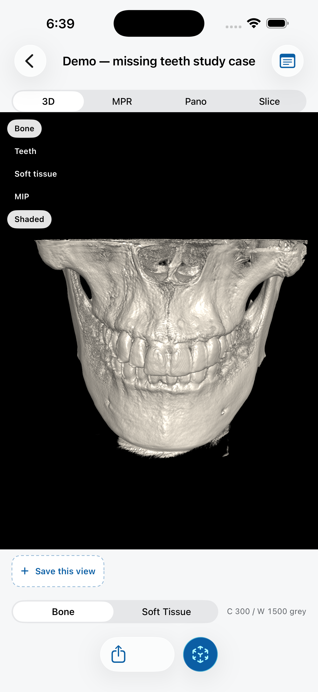
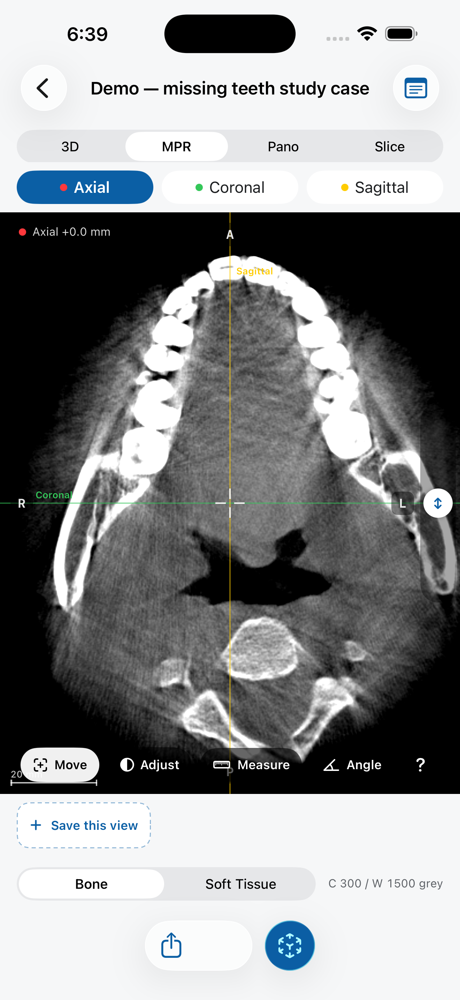
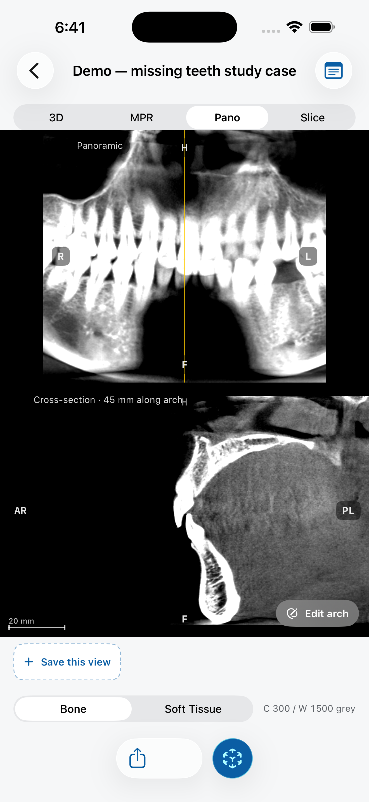
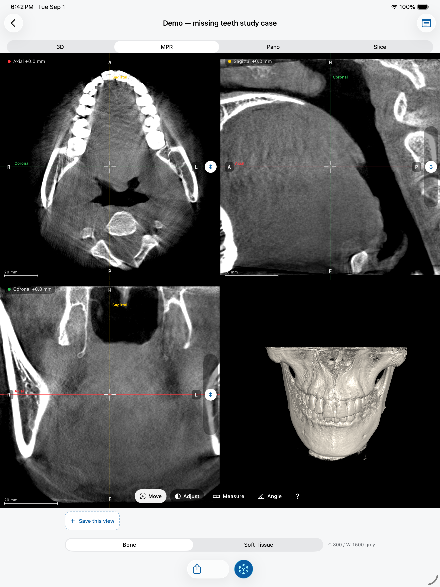

# JawAtlas

A free, fully offline CBCT viewer for dental students, educators and researchers. It turns a dental cone beam CT scan into an interactive 3D study companion on iPhone and iPad, with real radiological conventions, a panoramic reconstruction you trace yourself, and an augmented reality mode that puts the jaw life-size on the table in front of you.


<p align="center">
  
  
  
</p>

## Why this exists

Most dental students learn radiology from flat slides, but the scans they will read in practice are three dimensional. Desktop CBCT software is workstation-bound, licensed per seat, and built for clinicians rather than learners. JawAtlas takes the opposite approach: a small, free, offline app on the device students already carry, doing a handful of things to a professional standard instead of everything at once.

The app is an education and training aid. It is not a medical device, and it must not be used for diagnosis, treatment planning or any clinical decision.

## What it does

**Standard tri-planar MPR.** Axial, coronal and sagittal panes linked through a shared crosshair, with colored scout lines showing where each slice cuts. Orientation follows the radiological convention: the axial plane is viewed from the feet, so the patient's left appears on the right of the screen, and dynamic R, L, A, P, H, F edge labels are derived from the volume's DICOM orientation cosines, so they stay correct on oblique cuts and rotated volumes. On iPad the view is the classic 2x2 grid with a live 3D pane.

<p align="center">
  
</p>

**Built for learning, not just viewing.** The interface works in explicit, labeled modes: Move the crosshair, Adjust brightness and contrast, Measure in millimetres, or read an Angle in degrees. Each tool guides you step by step, and a first-open explainer card teaches the crosshair, the scout line colors and the tools in plain language. Grey values are labeled as grey values, not Hounsfield units, because CBCT intensity is not calibrated density and students should learn that early.

**Panoramic reconstruction the standard way.** Tap points along the dental arch on an axial slice, and the app builds the panoramic view on the GPU by sampling along the curve with an averaged slab, following the OPG convention with the patient's right on the viewer's left. Drag a scout line across the pano to drive a perpendicular cross-section, the same workflow used by clinical suites.

**Ray marched 3D with presets.** Bone, Teeth and Soft tissue transfer function presets, a shading toggle, and a MIP projection mode that reads like a radiograph. All rendering is Metal, targeting 60 fps.

**Augmented reality slice-through.** Anchor the scan life-size on a table and move your device through the anatomy; the cross-section follows the phone in real time. No free desktop tool offers this, and it requires a physical device.

**Cases that teach.** Slice to a structure, draw a mark on it, save it as a moment with a caption, and replay moments like slides. Cases travel with their moments and notes: share one with a classmate over AirDrop, or batch-import a folder of shared cases in one step. A summary of marked views exports as a PDF.

**Private by construction.** The app is 100 percent offline. No accounts, no analytics, no networking code at all, and an audit script enforces that. DICOM identifiers are never stored: the importer reads only a whitelist of technical tags, and tests verify that no identifying string survives into the app's storage format.

## Getting started

You need Xcode 26 or newer, iOS 18 or newer on the target device, and [xcodegen](https://github.com/yonaskolb/XcodeGen).

```bash
git clone https://github.com/Silvester969/JawAtlas.git
cd JawAtlas

# Download the demo scan (about 100 MB, fetched straight from the public dataset)
python3 scripts/fetch-demo-scan.py

# Generate the Xcode project and open it
xcodegen generate
open JawAtlas.xcodeproj
```

Select a simulator or your device and press Run. On first launch the app seeds the bundled demo case, and everything works from there with no further setup. The AR mode needs a real device; every other feature works in the simulator.

To run the test suite:

```bash
xcodebuild -project JawAtlas.xcodeproj -scheme JawAtlas \
  -destination 'platform=iOS Simulator,name=iPhone 17 Pro' \
  test -parallel-testing-enabled NO
```

There are around 160 tests covering the DICOM parser (including a fuzz corpus of mutated files), the compression codecs, ZIP hardening, volume geometry against 3D Slicer ground truth, orientation labels, the arch curve math, measurements, and the case store.

## How it is built

The codebase is deliberately small and has zero third-party dependencies. Everything, including the DICOM parser, the JPEG Lossless decoder and the ZIP reader, is written from scratch in Swift.

| Part | What it holds |
|---|---|
| `App/Sources` | SwiftUI app: case library, viewer stages (3D, MPR, Pano, Slice), AR mode, import flows, PDF export |
| `App/Sources/Rendering` | Metal renderer: ray marched volume, cross-section and panoramic fragment shaders, plane math |
| `JawAtlasCore` | Swift package: DICOM parser and codecs, series builder, volume store, geometry, story state |
| `Tests` | XCTest suite with synthesized DICOM fixtures, including a hand-rolled JPEG Lossless encoder |
| `scripts` | Demo scan fetcher, project generation, audit gates |

Details worth knowing before you read the code:

- **DICOM support:** Implicit and Explicit VR Little Endian, Deflated, RLE Lossless, and JPEG Lossless (processes 14 and 70). Lossy JPEG, JPEG 2000 and JPEG-LS are rejected per file with a clear message rather than failing the whole import. Multi-frame files, MONOCHROME1 inversion, missing rescale tags (with air-anchored calibration) and headerless datasets are all handled.
- **Storage:** each case is a directory with a JSON manifest, a raw little-endian Int16 voxel volume that is memory mapped at read time, a thumbnail, and the story file. The manifest is written last, atomically, so a killed import never leaves a visible half-case.
- **Rendering:** the volume lives in a single 3D Metal texture. The 3D view is a fullscreen-triangle ray marcher with central-difference gradients; MPR panes and the panoramic are single-pass fragment shaders sampling the same texture. The AR mode reuses the exact same plane mathematics with the camera pose as the plane source.
- **Robustness:** hostile input is a test target, not an afterthought. The parser survives a 240-case mutation corpus, and the ZIP reader is hardened against traversal, absolute paths and zip bombs.
- **No comments in the source.** A house rule enforced by `scripts/audit.sh`, which also greps for networking symbols to keep the offline promise honest.

## The demo dataset

The bundled demo case comes from the openly licensed dataset "Adults' dental cone beam computed tomography images dataset for detecting and classifying missing teeth" by Lan Feng, Zhi Li, Qihang Gu, Yaqi Wang and Xiaoyang Yu (Science Data Bank, [doi.org/10.57760/sciencedb.26465](https://doi.org/10.57760/sciencedb.26465)), used under CC BY 4.0. The fetch script downloads only the single case the app uses, straight from the archive, using HTTP range requests so you do not have to download the full 23 GB dataset.

## Contributing

Issues and pull requests are welcome. Good first areas: additional openly licensed teaching cases, a quiz mode over labeled moments, thick-slab MIP in the MPR panes, and NIfTI import for researchers. Before opening a PR, please run the test suite and `scripts/audit.sh`, and keep the two hard rules: no third-party dependencies, and no networking code of any kind.

If you are a dental educator interested in authoring annotated teaching cases, that is the single most valuable contribution this project can receive, and it requires no Swift at all. Open an issue and say hello.

## License

Code is licensed under the [Apache License 2.0](LICENSE). The JawAtlas name and icon are not covered by the code license; please do not publish forks under the same name. The demo dataset remains under its own CC BY 4.0 license, credited above and inside the app.

JawAtlas is an education and training aid. It is not a medical device and must not be used for diagnosis, treatment planning or any clinical decision.
